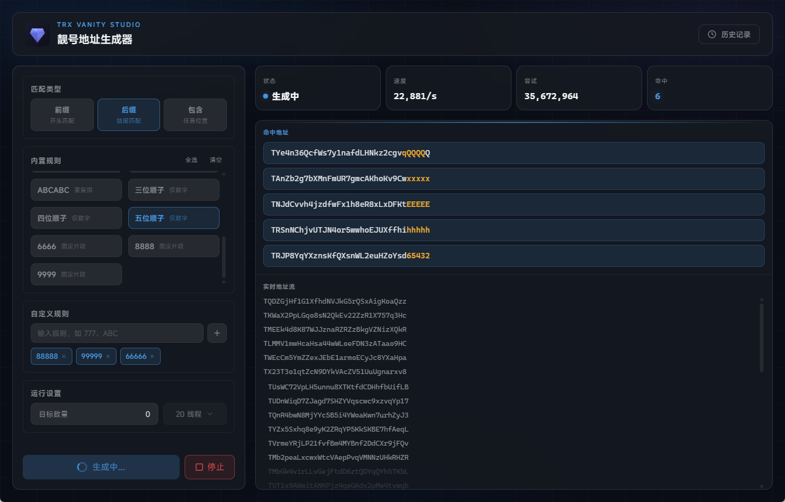

# TRX Vanity

本地运行的 TRX（波场）靓号钱包生成器，基于 Tauri 2 构建，支持多线程并行碰撞。



## 功能

- 按前缀、后缀、包含三种模式匹配地址
- 内置多种靓号规则（重复、顺子、自定义片段等）
- 多线程并行生成，线程数可调，充分利用 CPU
- 可设置目标命中数量，达标自动停止
- 实时地址流展示 + 命中高亮
- 命中结果本地 SQLite 持久化，支持搜索和筛选
- 历史记录支持复制、删除、二维码导出（扫码导入 imToken / TokenPocket）
- 私钥本地生成，不联网，不上传

## 技术栈

| 层   | 技术                                  |
| ---- | ------------------------------------- |
| 框架 | Tauri 2                               |
| 前端 | Vue 3 + TypeScript + Tailwind CSS 4   |
| 后端 | Rust（k256 / tiny-keccak / rusqlite） |
| 构建 | Vite 8                                |

## 开发

需要 [Node.js](https://nodejs.org/) 和 [Rust](https://www.rust-lang.org/tools/install) 环境。

```bash
npm install
npm run tauri:dev
```

## 构建

```bash
npm run tauri:build
```

产物在 `src-tauri/target/release/bundle/` 下。

## 安全说明

所有密钥对均在本地生成，使用 `k256` 椭圆曲线库 + 系统级随机数源（`getrandom`），不依赖任何远程服务。私钥存储在本地 SQLite 数据库中，敏感数据使用 `zeroize` 在内存中及时清除。

## License

MIT
